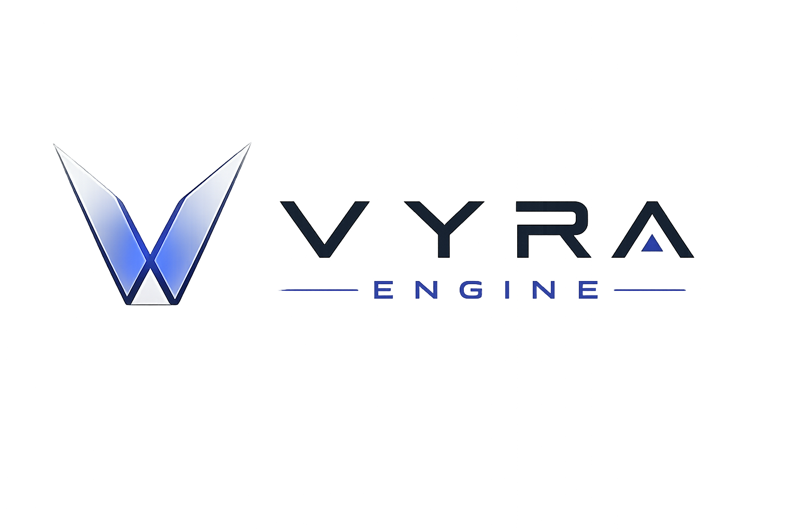

<p align="center">
  
</p>

<h1 align="center">VYRA ENGINE</h1>

<p align="center">
  <strong>Create. Command. Build.</strong><br/>
  <em>Where worlds are engineered.</em>
</p>

<p align="center">
  <a href="LICENSE"></a>
  <a href="#"></a>
  <a href="#"></a>
  <a href="#"></a>
  <a href="#"></a>
</p>

---

## Overview

**VYRA Engine** is a modern, open-source, multiplatform C++23 game engine designed from its architectural foundation for extreme performance, strict layer decoupling, modern Vulkan 1.4 rendering, and native agentic AI workflows.

Developed under **Florynx Labs**, VYRA provides a high-performance alternative engine built for engineers who value architectural elegance, low-latency execution, and zero technical debt.

---

## Key Features (v0.1 Foundation)

- **C++23 Native Core**: Modern C++ architecture (`vyra::core`, `vyra::platform`, `vyra::rhi`, `vyra::renderer`, `vyra::ecs`, `vyra::scene`, `vyra::editor`).
- **Vulkan 1.4 Dynamic RHI**: Complete Render Hardware Interface abstraction decoupled from engine logic via Volk.
- **Decoupled ECS**: EnTT backend encapsulated inside `vyra::ecs::Registry` and `vyra::ecs::Entity`.
- **Procedural Geometry & Mesh Renderer**: Built-in 3D mesh primitives (Cube, Grid floor, Sphere) and GLSL hemisphere lighting shader pipeline.
- **Deterministic Scene Serialization**: Human-readable `.vyra` JSON scene format with 128-bit UUID entity tracking.
- **Obsidian Dark Editor Shell**: Dear ImGui docking interface with HSL-tuned obsidian dark styling.
- **Transient World Isolation**: Sandbox Play Mode cloning authoring scenes to isolated runtime worlds (`Edit`, `Play`, `Pause`).
- **100% Automated Test Suite**: 21 Catch2 unit tests covering logger, UUID, timestep, events, RHI context, ECS, scene cloning, JSON roundtrips, camera flight, and mesh primitive generation.

---

## System Architecture

```
                  +-----------------------------------+
                  |            vyra_editor            |
                  |  (Dear ImGui Docking, Editor UI)  |
                  +-----------------+-----------------+
                                    |
                  +-----------------v-----------------+
                  |             vyra_scene            |
                  | (Scene, EditorCamera, Serializer) |
                  +-----------------+-----------------+
                                    |
                  +-----------------v-----------------+
                  |            vyra_renderer          |
                  |   (Mesh, Vertex3D, MeshRenderer)  |
                  +--------+----------------+---------+
                           |                |
         +-----------------v---+        +---v-----------------+
         |       vyra_ecs      |        |       vyra_rhi      |
         | (EnTT Engine Wrap)  |        | (Vulkan 1.4 Context)|
         +-----------------+---+        +---+-----------------+
                           |                |
         +-----------------v----------------v---------+
         |                vyra_platform               |
         |         (SDL3 Windowing & Events)          |
         +-------------------------+------------------+
                                   |
         +-------------------------v------------------+
         |                 vyra_core                  |
         |       (Log, UUID, Time, Assert, Types)     |
         +--------------------------------------------+
```

For detailed component documentation, see [Architecture Overview](docs/architecture.md).

---

## Architectural Decision Records (ADRs)

- [ADR 0001: C++23 Standard Adoption](docs/adrs/0001-cpp23-standard.md)
- [ADR 0002: Vulkan 1.4 RHI Abstraction](docs/adrs/0002-vulkan-rhi-abstraction.md)
- [ADR 0003: Decoupled ECS Architecture](docs/adrs/0003-entt-ecs-wrapper.md)
- [ADR 0004: JSON Scene Serialization](docs/adrs/0004-json-scene-serialization.md)
- [ADR 0005: Transient World Isolation](docs/adrs/0005-transient-world-isolation.md)

---

## Quick Start & Building

### Prerequisites
- **Compiler**: MSVC 2022 v17.8+ (Windows), GCC 13+ or Clang 17+ (Linux/macOS)
- **Build Tools**: CMake 3.28+, Ninja or MSBuild
- **SDK**: Vulkan SDK 1.3 / 1.4

### Build Commands

```bash
# Clone the repository
git clone https://github.com/florynx-labs/vyra-engine.git
cd vyra-engine

# Configure CMake build tree
cmake -S . -B build -DCMAKE_BUILD_TYPE=Debug

# Build engine, editor & tests
cmake --build build --config Debug

# Execute full automated test suite
ctest --test-dir build --output-on-failure -C Debug
```

---

## License

VYRA Engine is open-source software licensed under the [MIT License](LICENSE).  
Copyright (c) 2026 **Florynx Labs**.
